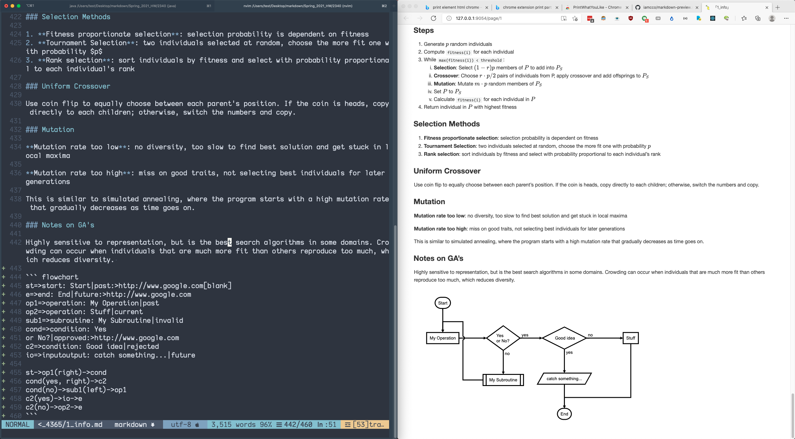
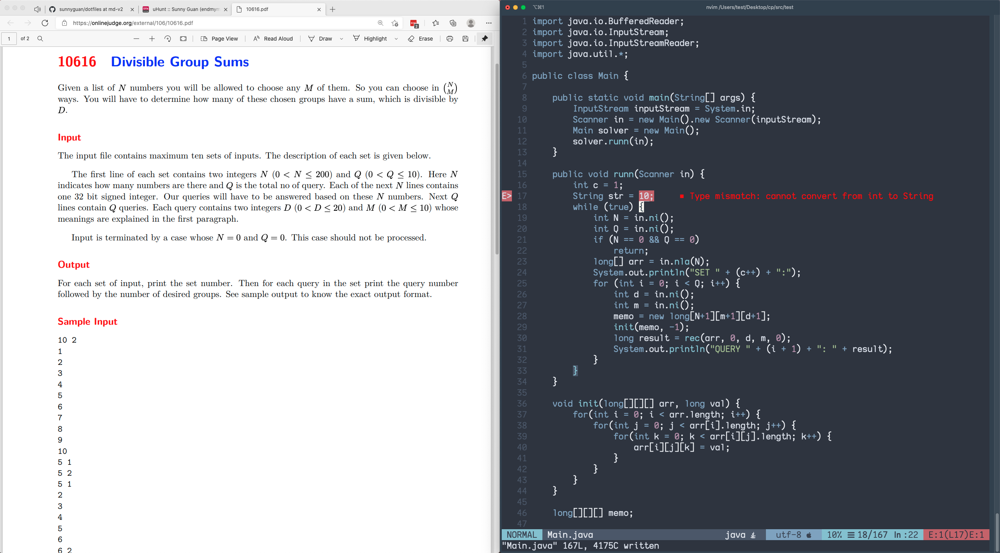

# dotfiles

This is my current setup for taking notes with Markdown as well as doing competitive programming with Java/C++. 

## Markdown

Main plugin used is [Markdown Preview](https://github.com/iamcco/markdown-preview.nvim), which is a lot easier to setup and work with compared to doing my own Pandoc setup. I edited the default styles a bit to make the preview full-width without the surrounding box/header. Those files can be found in the `md-styles/` directory.

## Programming

Requires [Neovim nightly](https://github.com/neovim/neovim/releases/tag/nightly) for the built-in LSP support. Most settings are standard, only a few tweaks to get Java and Ultisnips working.

For Java, these are the general steps for getting the language server installed and integrated with Neovim:

1. Install these Vim plugins (see `init.vim` for vim-plugs setup):
    1. `prabirshrestha/vim-lsp`
    2. `mattn/vim-lsp-settings`
    3. `mfussenegger/nvim-jdtls`
2. Open any Java file, and run `:LspInstallServer` to install jdtls language server
3. Now that the language server is installed, follow the steps [here](https://github.com/mfussenegger/nvim-jdtls) to connect it with Vim
    1. If your setup is similar to mine, you can reference [this bash script](https://github.com/sunnyguan/dotfiles/blob/md-v2/bin/java-lsp.sh) to see what the three directories (JAR location, Java location, OS-specific config location) should be
4. After it is installed, open up any Java file and the language server should load in automatically
